# Preview: AutoML Model Testing

> Welcome to the PREVIEW of **Azure Machine Learning Automated ML Model Testing**.
> The AutoML model testing feature provides support for automated model testing.

Automated Machine Learning, also referred to as Automated ML or AutoML, is
the process of automating the time consuming, iterative tasks of machine
learning model development. It allows data scientists, analysts, and
developers to quickly and easily build ML models with high scale, efficiency,
and productivity all while sustaining model quality.

The AutoML model testing feature allows the user to test the models which are
generated by AutoML training runs. Testing a model takes as input a test dataset
and outputs predictions and metrics for those predictions.

There are currently two supported scenarios:

1. Test the best model which is created by the main AutoML run.
   The model testing run will be started automatically at the end of the main run
   after all models have been created and the best model has been identified.
2. Test any model after the main AutoML run has completed ("on-demand" model testing).
   These test runs are started manually by the user either using the SDK or the UI.

Model testing is supported for the following task types:

- Classification
- Regression
- Forecasting

## Requirements

- An Azure subscription. If you don't have an Azure subscription, [create a free account](https://aka.ms/AMLFree) before you begin.
- A valid Azure Machine Learning workspace. See [here](https://docs.microsoft.com/en-us/azure/machine-learning/concept-workspace)
  for more details and how to create one.
- AzureML SDK version 1.29 or later for script and notebook environments.
  See [here](https://docs.microsoft.com/en-us/python/api/overview/azure/ml/install?view=azure-ml-py) for SDK installation details.

## Getting Started

There are three ways to start a test run from a script or a notebook.
See the included notebooks for examples and further details.

1. Providing an existing test dataset when creating the `AutoMLConfig`.

    ```python
    automl_config = AutoMLConfig(task='forecasting',
                                 ...
                                 # Provide an existing test dataset
                                 test_data=test_dataset,
                                 ...
                                 forecasting_parameters=forecasting_parameters)
    ```
    Supported input test dataset types: [Dataset](https://docs.microsoft.com/en-us/python/api/azureml-core/azureml.core.dataset.dataset?view=azure-ml-py).

    Sample notebooks:
    - [auto-ml-regression.ipynb](notebooks/regression/auto-ml-regression.ipynb)
    - [auto-ml-forecasting-orange-juice-sales.ipynb](notebooks/forecasting-orange-juice-sales/auto-ml-forecasting-orange-juice-sales.ipynb)

2. Specifying a train/test percentage split when creating the `AutoMLConfig`.
   Note, this scenario is not supported for forecasting tasks.

   ```python
   automl_config = AutoMLConfig(task = 'regression',
                                ...
                                # Specify train/test split
                                training_data=training_data,
                                test_size=0.2)
   ```
   To use a train/test split instead of providing test data directly, use the
   `test_size` parameter when creating the `AutoMLConfig`. This parameter
   must be a floating point value between 0.0 and 1.0 exclusive and specifies
   the percentage of the training dataset that should be used for the test
   dataset. For regression based tasks, random sampling is used. For
   classification tasks, stratified sampling is used. Forecasting does not
   currently support specifying a test dataset using a train/test split.

   The `test_data` and `test_size` `AutoMLConfig` parameters are mutually
   exclusive and can not be specified at the same time.

    Sample notebooks:
    - [auto-ml-classification-credit-card-fraud.ipynb](notebooks/classification-credit-card-fraud/auto-ml-classification-credit-card-fraud.ipynb)

3. Use `ModelProxy` to test a model after the main AutoML run has completed
   (aka. "on-demand" model testing).

    ```python
    from azureml.train.automl.model_proxy import ModelProxy

    model_proxy = ModelProxy(best_run)
    predictions, metrics = model_proxy.test(test_data)
    ```
    Supported input test dataset types: [Dataset](https://docs.microsoft.com/en-us/python/api/azureml-core/azureml.core.dataset.dataset?view=azure-ml-py).

    Sample notebooks:
    - [auto-ml-regression.ipynb](notebooks/regression/auto-ml-regression.ipynb)
    - [auto-ml-classification-credit-card-fraud.ipynb](notebooks/classification-credit-card-fraud/auto-ml-classification-credit-card-fraud.ipynb)
    - [auto-ml-forecasting-orange-juice-sales.ipynb](notebooks/forecasting-orange-juice-sales/auto-ml-forecasting-orange-juice-sales.ipynb)

### Get the Predictions and Metrics Generated by the Test Run Using the SDK

When a remote test run is requested by passing in a value for `test_data` or
`test_size` to `AutoMLConfig`, only the best training run will have a test run
associated with it.

```python
best_run, fitted_model = remote_run.get_output()
test_run = next(best_run.get_children(type='automl.model_test'))
test_run.wait_for_completion(show_output=False, wait_post_processing=True)

# Get test metrics
test_run_metrics = test_run.get_metrics()
for name, value in test_run_metrics.items():
    print(f"{name}: {value}")

# Get test predictions as a Dataset
test_run_details = test_run.get_details()
dataset_id = test_run_details['outputDatasets'][0]['identifier']['savedId']
test_run_predictions = Dataset.get_by_id(workspace, dataset_id)
predictions_df = test_run_predictions.to_pandas_dataframe()

# Alternatively, the test predictions can
# be retrieved via the run outputs.
test_run.download_file("predictions/predictions.csv")
predictions_df = pd.read_csv("predictions.csv")
```

`ModelProxy` already returns the predictions and metrics and
does not require further processing to retrieve the outputs.

## AutoML Model Testing via Workspace Portal UI 

There are 2 ways to start a model test run via UI

    1. Start a model test run while creating a new AutoML run.
    2. Start an on-demand model test run for a completed model.

### Start a model test run while creating a new AutoML run.
1. Browse to [https://ml.azure.com/](https://ml.azure.com/). Click on `Create new` button -> select `New Automated ML run`. Follow the steps to create a new AutoML run.
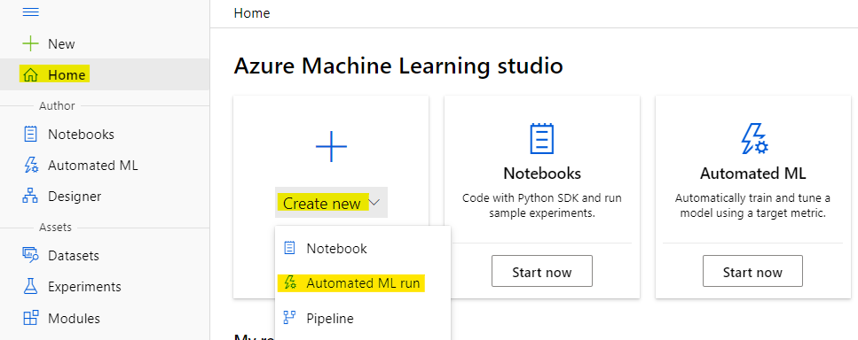

2. On the **[Optional] Validate** step -> Test dataset -> Select **Provide a test dataset** option.

    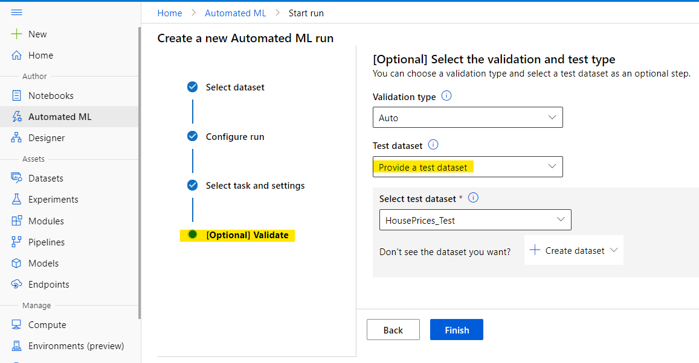

    Dataset options:
    - Select a test dataset from the dropdown.
    - Or create a new dataset by clicking `Create dataset` button.

    Dataset schema:
    - The schema of the test dataset should match the training dataset (The Target column is optional).
    - The test dataset should not be the same as training dataset or the validation dataset.

3. If you prefer test dataset to be a split percentage of training dataset, in the `Test dataset` dropdown -> Select **Test split (choose a percentage of the training data)** option.
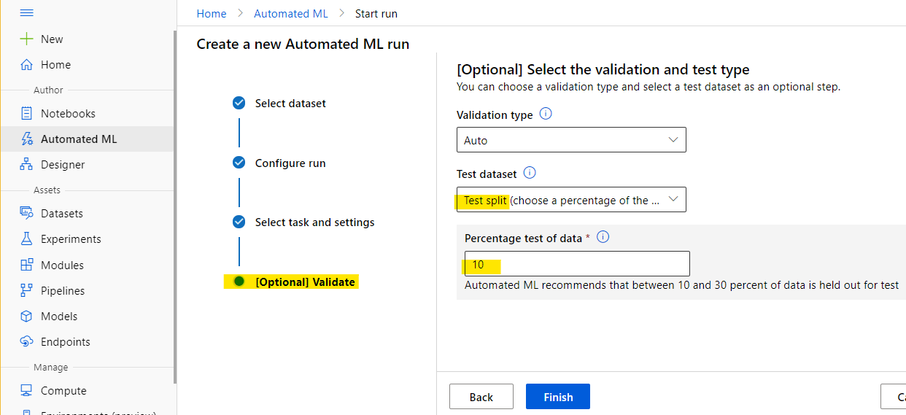

4. Click the `Finish` button. After the run gets completed, navigate to the `Models` tab of the run and click on the `best model`.
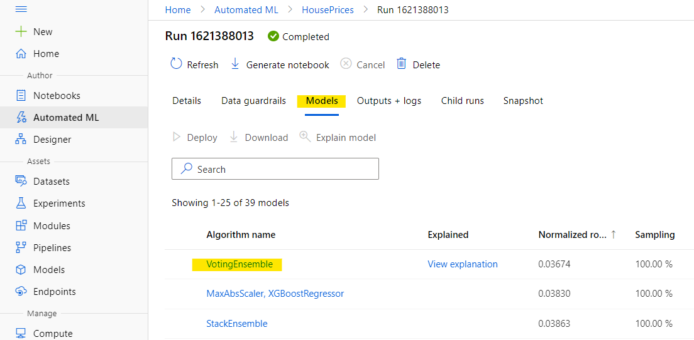

6. On the `model details` page, navigate to the `Test results` tab. It lists the model test run(s). Click on a run in the list to view the test run details.
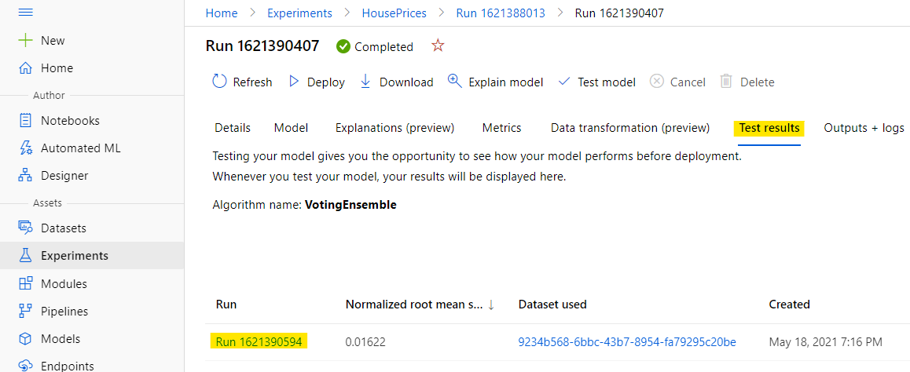

7. On the `model test run detail` page, click on the 'Output datasets' link to explore the predictions dataset.
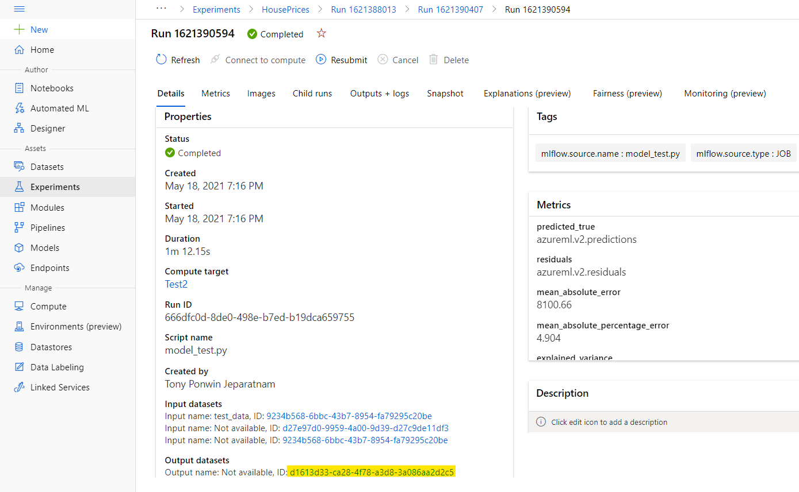

8. On the `dataset details` page, click on `Explore` to preview the predictions csv.
Note: Work is in progress to easily download the predictions dataset file.
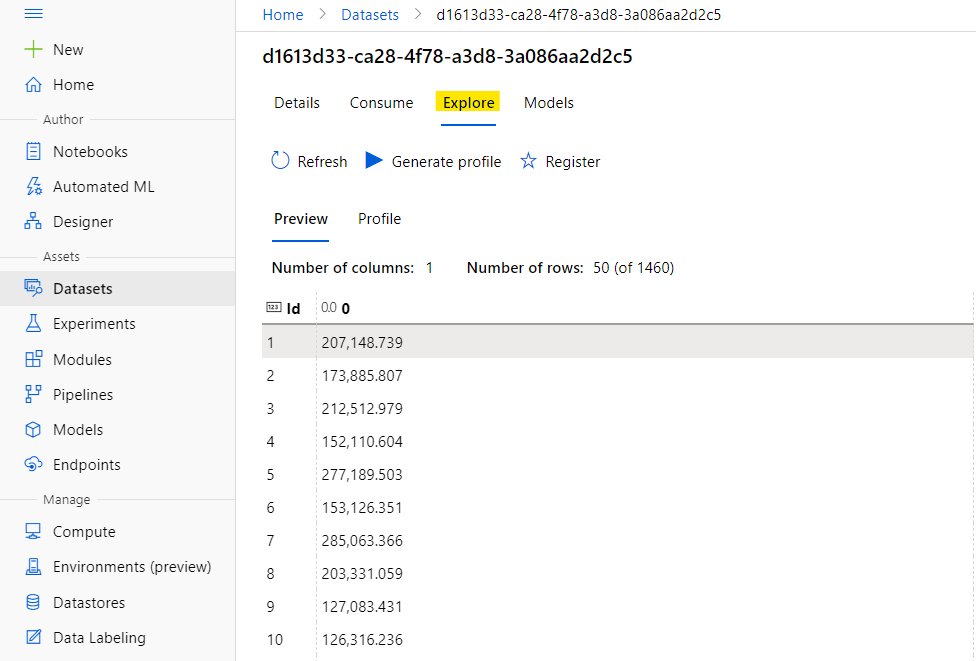

9. Alternatively the prediction file can be also viewed/downloaded from `outputs + logs` tab, expand `Outputs` to locate `predicted_true file`. 
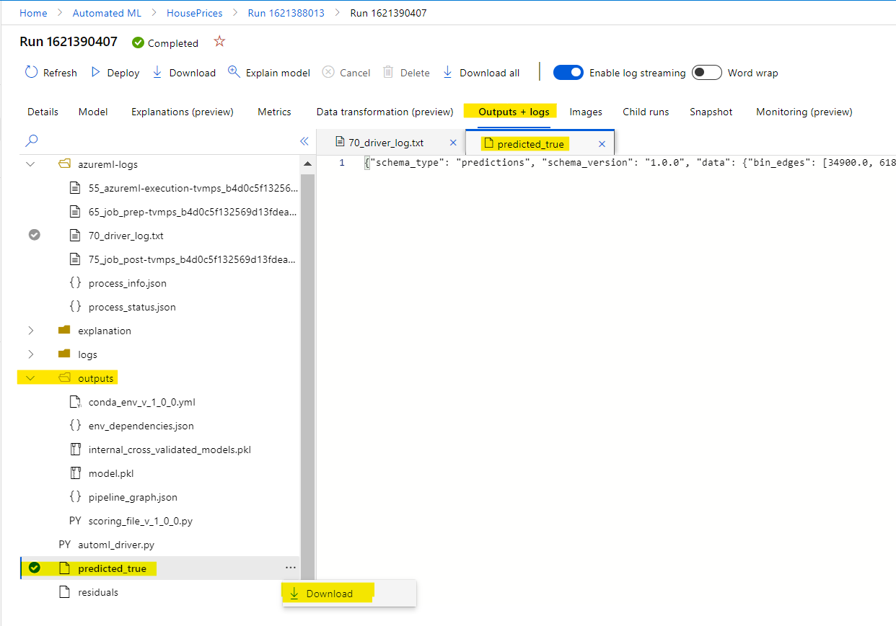
### Start an on-demand model test run for a completed model.

1. Browse to [https://ml.azure.com/](https://ml.azure.com/). On the left navigation click on `Automated ML` -> select an existing run to open the `run details` page.
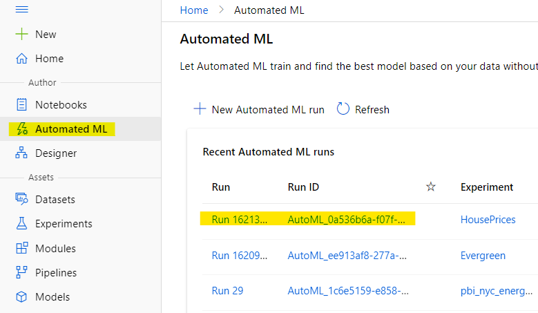

2. Navigate to the `Models` tab of the run and click on a completed `model` link for which a `model test` run has to be created.


3. On the `model details` page, click on the `Test model` button to open the `Test model` panel.
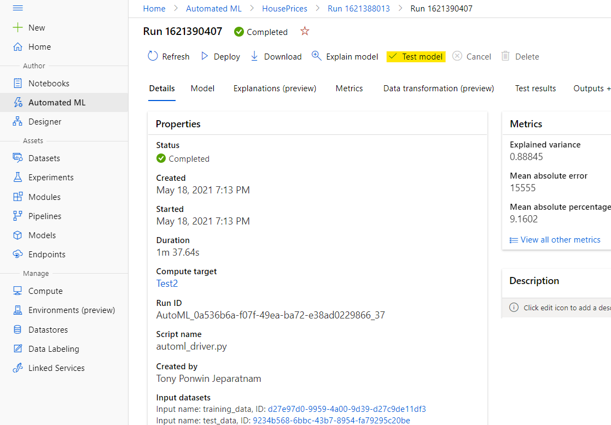

4. On the `Test model` panel, select `compute cluster` and a `test dataset` and click the `Test` button. The schema of the test dataset should match the training dataset (The Target column is optional).
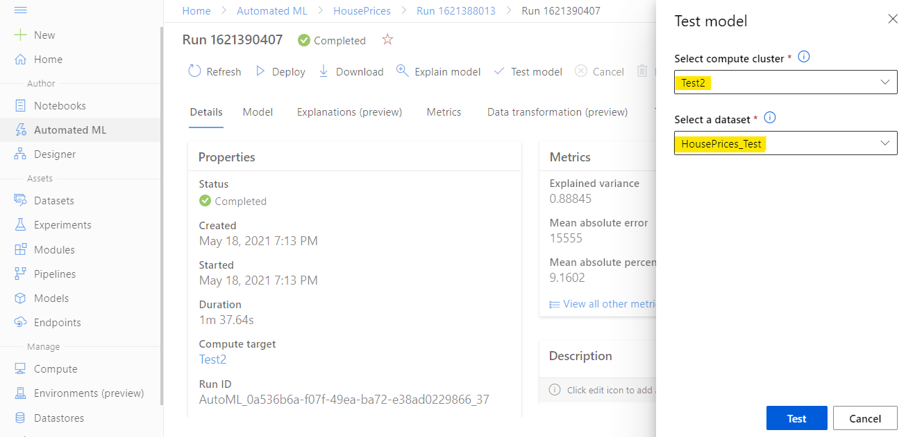

5. On successful creation of `model test run`, the details pages will be displayed with a success message. Click on the `Test Results` tab to see the progress of the run. Click on the link to the test run to open its details page. 
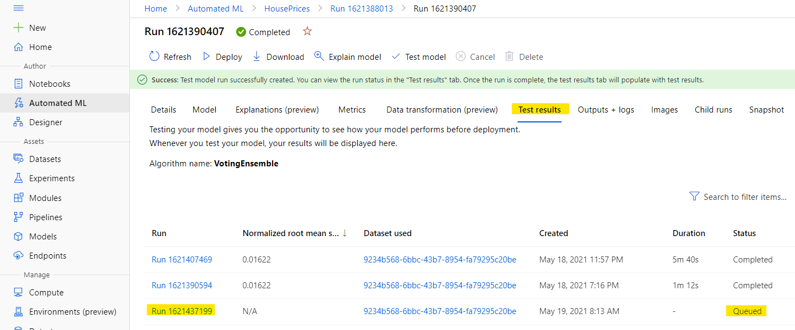

7. On the `model test run detail` page, after the run completes, click on the 'Output datasets' link to explore the predictions dataset.
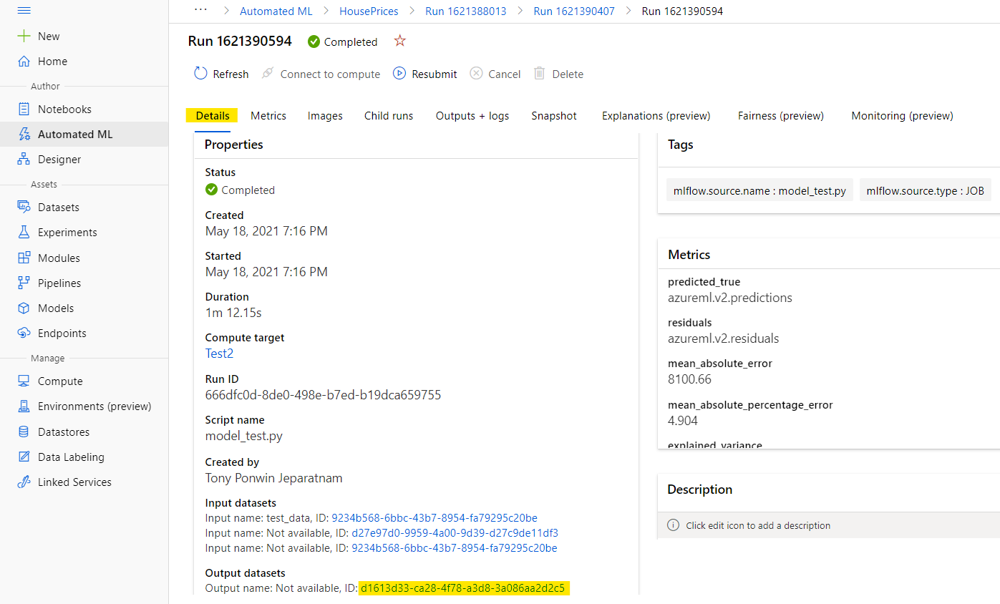

8. On the `dataset details` page, click on `Explore` to preview the predictions csv. Note: Work is in progress to easily download the predictions dataset file.
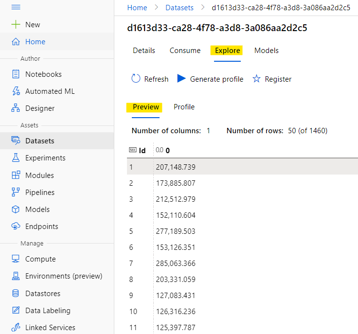

9. Alternatively the prediction file can be also viewed/downloaded from `outputs + logs` tab, expand `Outputs` to locate `predicted_true file`. 


## Limitations

- The predictions.csv file which is generated by the model test run will be stored
    in the default datastore which gets created when the machine learning workspace
    is created (`workspaceblobstore`). This datastore is visible to all users with
    the same subscription. Do not use this feature if any of the information used for
    or created by the test run needs to remain private.

    Workspaces and resource groups can be secured with "Access Control (IAM)".
    See the "Access Control (IAM)" section of the respective resource in the Azure portal.

- Local AutoML runs do not support test runs. To use this feature, please use remote runs.
- ADB/Spark runs do not support test runs.
- Pandas DataFrames are not supported as input test datasets.
    Supported input test dataset types: [Dataset](https://docs.microsoft.com/en-us/python/api/azureml-core/azureml.core.dataset.dataset?view=azure-ml-py).
- Model testing feature is disabled when forecasting DNN models are used (non-DNN based forecasting is supported).
    However, the feature works with text DNNs, because AutoML uses text DNNs as a featurizer.
- Forecasting runs do not support train/test split (`test_size` parameter to `AutoMLConfig`).
- The on-demand model testing feature will not work for runs created with an SDK older than 1.29.
    To use this feature, the run must have been created with SDK version >= 1.29.
- `test_data`/`test_size` is not supported at the same time as `cv_split_column_names`
- `test_data`/`test_size` is not supported at the same time as `cv_splits_indices`
- Test runs are not supported for AutoML runs which only have the following models
    in the `allowed_models` list:
    [AveragedPerceptronClassifier, FastLinearRegressor, OnlineGradientDescentRegressor].
- Model testing is not supported for image classification tasks.

## Contributing

We welcome contributions and suggestions! See [CONTRIBUTING.md](CONTRIBUTING.md) for more details.

### Issues and feedback

All forms of feedback are welcome through this repo's issues:
https://github.com/Azure/automl-testdataset-preview/issues

Please see the [contributing guidelines](CONTRIBUTING.md) for further details.

## Code of Conduct

This project has adopted the [Microsoft Open Source Code of Conduct](https://opensource.microsoft.com/codeofconduct/). Please see the [code of conduct](CODE_OF_CONDUCT.md) for details.

## Trademarks

This project may contain trademarks or logos for projects, products, or services. Authorized use of Microsoft 
trademarks or logos is subject to and must follow 
[Microsoft's Trademark & Brand Guidelines](https://www.microsoft.com/en-us/legal/intellectualproperty/trademarks/usage/general).
Use of Microsoft trademarks or logos in modified versions of this project must not cause confusion or imply Microsoft sponsorship.
Any use of third-party trademarks or logos are subject to those third-party's policies.
